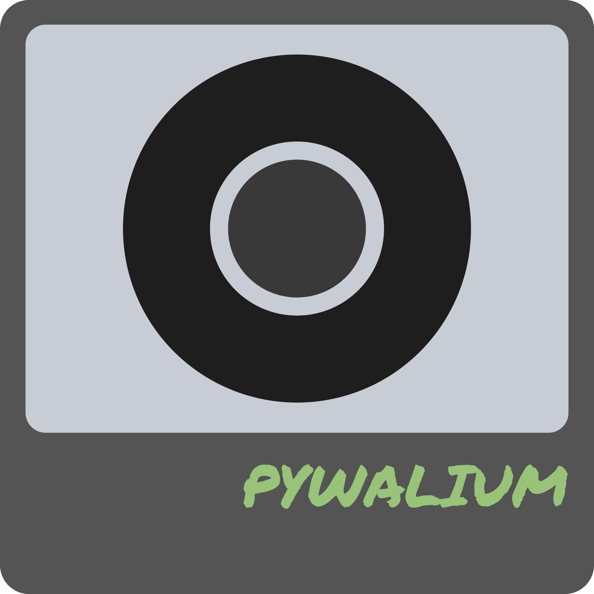

<h3 align="center"></h3>

🎨 Generate Chromium theme based on <a href="https://github.com/dylanaraps/pywal">Pywal</a> colors.

## Usage

1. Execute `generate.sh` to generate the theme in the "pywalium-theme" folder.
2. Go to <a href="chrome://extensions/">chrome://extensions/</a> and check "Developer mode".
3. Click "Load unpacked" and select the "pywalium-theme" folder generated in step 1.
4. Done ✅

You have to execute the generate script every time the pywal colors change. You could do this by setting the `-o` option of the `wal` command to the generate script.

To apply the changes to the current chromium instance, you either have to manually reload the theme using "Load unpacked" or you can restart the browser by typing <a href="chrome://restart">chrome://restart</a> in the search bar.

## Credits

[ChromiumPywal](https://github.com/metafates/ChromiumPywal) & [Pywalfox](https://github.com/Frewacom/pywalfox) - inspiration

[dye/dyetide](https://github.com/tomit4/dyetide) - color conversion code
